# INFORME DE ANALISIS COMPLETO - PROYECTO NAVI BACKEND

## 1. FUNCIONALIDADES IMPLEMENTADAS

### 1.1 Autenticación y Gestión de Usuarios

**Completamente Implementadas:**

- **Registro de Usuarios (Pasajeros)** - `POST /users/signup`
  - Validación de email único
  - Hash de contraseñas con bcryptjs (10 rondas)
  - Validación de formato de teléfono hondureño (+504 ####-####)
  - Campos: email, firstName, lastName, phone, password

- **Login de Usuarios** - `POST /users/login`
  - Autenticación con email/password
  - Generación de JWT con expiración de 14 horas
  - Payload incluye: userId, email, role, firstName, lastName

- **Registro de Conductores** - `POST /indproviders/signup`
  - Campos adicionales: birthdate, address, serviceType, bio, availability
  - Estado inicial: verified: false
  - Coordenadas geoespaciales (currentLoc) con valor por defecto [0,0]

- **Login de Conductores** - `POST /indproviders/login`
  - Requiere verificación de cuenta (verified: true) para autenticarse
  - Rechaza login si cuenta no está verificada (403)

### 1.2 Gestión de Disponibilidad de Conductores

**Implementado:**

- **Esquema de Disponibilidad Semanal** (slots)
  - Formato: `{ day: 0-6, start: "HH:MM", end: "HH:MM" }`
  - Validación de formato HH:MM
  - Validación pre-save: end > start
  - Prevención de duplicados (día/hora inicio)

- **Consulta de Conductores Disponibles** - `GET /indproviders/available?start=<ISO>&duration=<minutes>`
  - Conversión UTC correcta
  - Filtrado por isOnline: true
  - Matching de slots de disponibilidad
  - Ordenamiento por rating descendente

- **Función subtractSlot()** en scheduledMatcher.js
  - Resta tiempo consumido de slots de disponibilidad
  - Manejo de split de slots (booking en medio de slot)
  - Manejo de overlaps parciales

### 1.3 Sistema de Reservas (Bookings)

**Completamente Implementado:**

- **Creación de Booking** - `POST /bookings/newBooking`
  - Validaciones: userID, pickup, dropoff, carPreference, scheduledStart
  - Cálculo automático de scheduledEndTime
  - Soporte para carPreference: 'user' | 'driver'
  - Status inicial: 'pending'
  - Campos opcionales: pickupAddress, dropoffAddress

- **Flujo de Estados del Booking:**
  - pending → accepted → in_progress → completed/cancelled/no_show
  - Endpoints PATCH para cada transición de estado
  - Actualización automática de actualStartTime y actualEndTime

- **Consultas de Bookings:**
  - GET / - Todos los bookings
  - GET /:bookingID - Booking específico
  - GET /users/:userID - Bookings por usuario
  - GET /drivers/:driverID - Bookings por conductor
  - GET /available - Bookings pendientes sin asignar (NOTA: Este endpoint tiene un problema de ordenamiento de rutas)

- **Asignación Atómica de Conductor** - `PATCH /bookings/assignAccept/:bookingID`
  - Previene race conditions con findOneAndUpdate
  - Solo asigna si status='pending' y provider=null
  - Retorna 409 si ya fue aceptado

### 1.4 Sistema Real-Time (Socket.io)

**Completamente Implementado:**

- **Autenticación de Sockets**
  - JWT validado en socket.handshake.auth.token
  - Desconexión automática si token inválido
  - Payload extrae userId y role

- **Gestión de Presencia de Conductores:**
  - Al conectar: isOnline=true, socketId guardado
  - Al desconectar: isOnline=false, socketId=null

- **Eventos de Socket Implementados:**
  - `joinTrip` - Une socket a room privado de viaje
  - `location` - Streaming de GPS del conductor (cada ~3s)
  - `bookingAccept` - Conductor acepta reserva
  - `bookingDecline` - Conductor rechaza reserva
  - `tripStart` - Inicia viaje (status → in_progress)
  - `tripEnd` - Finaliza viaje (status → completed)

- **Emisión de Eventos desde REST:**
  - Uso de global.io en bookings.js
  - Eventos: tripStarted, tripCompleted, rideCancelled, driverArrived, driverAssigned, rideMatched

### 1.5 Matching Automático de Conductores

**Implementado:**

- **Cron Job** - Ejecuta cada 15 minutos (node-cron: `*/15 * * * *`)
- **Ventana de Matching:** 90 minutos antes del viaje
- **Deadline:** 15 minutos antes del viaje
- **Algoritmo:**
  1. Busca bookings pending con scheduledStart <= ahora + 90min
  2. Filtra conductores ONLINE con availability que cubre todo el viaje
  3. Ordena por rating DESC
  4. Envía bookingRequest al primer conductor
  5. Espera 10 minutos por respuesta
  6. Si rechaza/timeout, pasa al siguiente
  7. Si todos los online rechazan, intenta con OFFLINE
  8. Si nadie acepta antes del deadline, marca booking como 'unfilled'

### 1.6 Gestión de Vehículos

**Modelo Car Implementado:**
- Propietario polimórfico (User o indProvider)
- Campos: make, model, year, color, licensePlate (único)
- vehicleType: enum con 6 tipos
- Flags: verified, mainCar, automatic, armored
- Referencias bidireccionales con carWallet en User e indProvider
- Validación: mainCar debe estar en carWallet

### 1.7 Direcciones y Rutas

**Implementado - GET /directions**
- Integración con Mapbox Directions API
- Cache en memoria (TTL 60 segundos)
- Validación de coordenadas lng/lat
- Soporte para profiles: driving, driving-traffic
- Retorna FeatureCollection GeoJSON con geometry LineString
- Incluye distance (metros) y duration (segundos)

### 1.8 Administración

**Parcialmente Implementado:**
- **Verificación de Conductores** - `PATCH /indproviders/verify/:driverId`
  - Marca verified=true
  - Sin autenticación de admin (FALTA)

---

## 2. FUNCIONALIDADES INCOMPLETAS O PENDIENTES

### 2.1 PROBLEMAS DE SEGURIDAD CRÍTICOS

**PRIORIDAD ALTA - RIESGOS DE SEGURIDAD:**

1. **Credenciales Hardcoded en nodemon.json**
   - UBICACIÓN: `/nodemon.json` líneas 2-7
   - PROBLEMA: Contraseña de MongoDB, JWT secret, y Mapbox token en repositorio
   - IMPACTO: Si este archivo está en Git, las credenciales están expuestas públicamente
   - SOLUCIÓN REQUERIDA: Mover TODAS las credenciales a archivo `./env` y agregarlo a .gitignore

2. **Inconsistencia JWT_SECRET vs JWT_KEY**
   - UBICACIÓN:
     - `api/socket/index.js:37` usa `process.env.JWT_SECRET`
     - `api/middleware/check-auth.js:5` usa `process.env.JWT_KEY`
     - `api/routes/users.js:111` usa `process.env.JWT_KEY`
     - `api/routes/indproviders.js:195` usa `process.env.JWT_KEY`
   - PROBLEMA: Si solo JWT_KEY está definido, los sockets NO funcionarán
   - IMPACTO: Autenticación de WebSocket fallará silenciosamente
   - SOLUCIÓN: Unificar a JWT_SECRET en todos los archivos

3. **CORS Abierto a Todos los Orígenes**
   - UBICACIÓN: `api/socket/index.js:21`
   - CÓDIGO: `cors: { origin: "*" }`
   - COMENTARIO EN CÓDIGO: "TODO tighten in production"
   - IMPACTO: Cualquier sitio web puede conectarse a los sockets
   - SOLUCIÓN: Configurar lista blanca de dominios permitidos

4. **Falta Validación de Autorización en Endpoints Críticos**
   - UBICACIÓN: Múltiples rutas en bookings.js, users.js
   - PROBLEMA:
     - DELETE /users/:userId - NO usa checkAuth
     - DELETE /bookings/removeBooking/:bookingID - NO usa checkAuth
     - PATCH /bookings/* - NO valida que el usuario sea dueño del booking
     - PATCH /indproviders/verify/:driverId - NO requiere rol de admin
   - IMPACTO: Cualquiera puede eliminar usuarios/bookings sin autenticación

5. **Token en Body en lugar de Header**
   - UBICACIÓN: `api/middleware/check-auth.js:5`
   - PROBLEMA: `req.body.token` en lugar de Authorization header
   - IMPACTO: No sigue estándares REST, dificulta integración con clientes HTTP estándar

### 2.2 BUGS CRÍTICOS IDENTIFICADOS (Segunda Revisión Exhaustiva)

**Total de Bugs Encontrados:** 15 (6 Críticos P0, 4 Altos P1, 3 Medios P2, 2 Bajos P3)

---

#### **PRIORIDAD P0 - SISTEMA NO FUNCIONA**

**BUG CRÍTICO #1: El Cron Job del Matcher NUNCA SE EJECUTA** ⚠️
- **UBICACIÓN:** `api/services/scheduledMatcher.js` línea 110, `server.js`
- **PROBLEMA:**
  - El archivo scheduledMatcher.js define el cron job: `cron.schedule("*/15 * * * *", ...)`
  - **PERO NUNCA SE IMPORTA EN server.js NI EN app.js**
  - El cron se define pero nunca se inicializa
- **EVIDENCIA:**
  ```bash
  $ grep -rn "scheduledMatcher" --exclude-dir=node_modules
  /api/socket/index.js:16:const { subtractSlot } = require("../services/scheduledMatcher");
  # Solo se importa subtractSlot, NO el cron job completo
  ```
- **IMPACTO:** **CRÍTICO**
  - Los bookings NUNCA se matchean automáticamente cada 15 minutos
  - Los conductores NUNCA reciben requests automáticas
  - El sistema depende 100% de matching manual via Socket.io
- **SOLUCIÓN:** Agregar en server.js: `require('./api/services/scheduledMatcher');`

---

**BUG CRÍTICO #2: Campo `scheduledStart` vs `scheduledStartTime`** ⚠️
- **UBICACIÓN:**
  - `api/models/booking.js:74` define `scheduledStartTime`
  - `api/services/scheduledMatcher.js:116,120,184` usa `scheduledStart`
- **PROBLEMA:** Los nombres NO coinciden
- **EVIDENCIA:**
  ```javascript
  // booking.js línea 74
  scheduledStartTime: { type: Date },

  // scheduledMatcher.js línea 116
  const pending = await Bookings.find({
    status: "pending",
    scheduledStart: { $lte: windowStart },  // ❌ CAMPO INCORRECTO
  });
  ```
- **IMPACTO:** **CRÍTICO**
  - La query MongoDB retorna 0 resultados siempre
  - Incluso si el cron se inicializara, NO encontraría bookings pendientes
- **SOLUCIÓN:** Cambiar todas las referencias de `scheduledStart` a `scheduledStartTime` en scheduledMatcher.js

---

**BUG CRÍTICO #3: Campo `driver` vs `provider` en Socket Handler** ⚠️
- **UBICACIÓN:** `api/socket/index.js:85`
- **PROBLEMA:**
  - Modelo Booking usa campo `provider` (booking.js:8-12)
  - Socket handler intenta actualizar `update.driver = userId`
  - **El campo `driver` NO EXISTE en el modelo**
- **EVIDENCIA:**
  ```javascript
  // socket/index.js línea 85
  const update = { status: "accepted", driver: userId };  // ❌ Campo NO existe

  // booking.js línea 8-12
  provider: {
    type: mongoose.Schema.Types.ObjectId,
    ref: "IndProvider",  // ✓ Campo correcto
  ```
- **IMPACTO:** **CRÍTICO**
  - Cuando un driver acepta via socket, el booking NO se asigna
  - El campo `provider` queda `null` en la base de datos
- **SOLUCIÓN:** Cambiar `driver` a `provider` en socket/index.js:85

---

**BUG CRÍTICO #4: JWT Payload Inconsistencia `id` vs `userId`/`providerId`** ⚠️
- **UBICACIÓN:**
  - `api/socket/index.js:43` espera `payload.id`
  - `api/routes/users.js:105` genera `payload.userId`
  - `api/routes/indproviders.js:188` genera `payload.providerId`
- **PROBLEMA:** Los nombres NO coinciden
- **IMPACTO:** **CRÍTICO**
  - Los sockets NO pueden autenticar correctamente
  - `userId` será `undefined` en todos los handlers
  - Los location updates fallan silenciosamente
- **SOLUCIÓN:** Unificar el nombre del campo en el payload JWT

---

**BUG CRÍTICO #5: Password Expuesto - Typo `selected` vs `select`** ⚠️
- **UBICACIÓN:** `api/models/user.js:53`
- **PROBLEMA:**
  ```javascript
  password: { type: String, required: true, selected: false },
  //                                         ^^^^^^^^ ❌ Typo
  ```
  Correcto: `select: false` (no "selected")
- **IMPACTO:** **CRÍTICO - SEGURIDAD**
  - El password NO se oculta en queries
  - GET `/users` retorna passwords hasheados a clientes
  - **VULNERABILIDAD DE SEGURIDAD**
- **SOLUCIÓN:** Cambiar `selected: false` a `select: false`

---

**BUG CRÍTICO #6: CheckAuth NO Se Usa en 95.6% de Endpoints** ⚠️
- **UBICACIÓN:** TODOS los archivos en `api/routes/`
- **PROBLEMA:** De 23 endpoints definidos, solo 1 usa checkAuth
- **ENDPOINTS SIN AUTENTICACIÓN:**
  - GET `/users` ❌
  - DELETE `/users/:userId` ❌
  - GET `/users/:userId` ❌
  - PATCH `/indproviders/verify/:driverId` ❌
  - DELETE `/bookings/removeBooking/:bookingID` ❌
  - TODOS los PATCH de bookings ❌
- **EVIDENCIA:**
  ```javascript
  // users.js línea 8
  const checkAuth = require("../middleware/check-auth"); //Add in later

  // bookings.js línea 5
  const checkAuth = require("../middleware/check-auth"); // ⬅️ not used yet
  ```
- **IMPACTO:** **CRÍTICO - SEGURIDAD**
  - Cualquiera puede eliminar usuarios
  - Cualquiera puede cancelar bookings
  - Cualquiera puede verificar conductores
- **SOLUCIÓN:** Aplicar middleware checkAuth a todos los endpoints privados

---

#### **PRIORIDAD P1 - SEGURIDAD Y FUNCIONALIDAD ALTA**

**BUG #7: Credenciales Hardcoded en nodemon.json**
- **UBICACIÓN:** `/nodemon.json`
- **PROBLEMA:**
  ```json
  {
    "env": {
      "MONGO_ATLAS_PW": "ServiWebJoeyBanana",
      "JWT_KEY": "secretsecret",
      "MAPBOX_TOKEN": "sk.eyJ1Ijoic2ViYXNmYXJhaiIsImEiOiJjbWV4YXgxNjAwd2tyMmxvb3BtMThpcGg0In0.gowGQOufjlBFQOdjhPVQ6w"
    }
  }
  ```
- **IMPACTO:** **ALTA - SEGURIDAD**
  - Credenciales expuestas en repositorio Git
  - Password de MongoDB público
  - JWT secret débil ("secretsecret")
- **SOLUCIÓN:**
  - Mover credenciales a archivo `.env`
  - Agregar `nodemon.json` y `.env` a `.gitignore`
  - Cambiar todas las credenciales comprometidas

---

**BUG #8: Archivo `env` No Existe - Path Incorrecto**
- **UBICACIÓN:** `/app.js:6`
- **PROBLEMA:**
  ```javascript
  require("dotenv").config({ path: "./env" });  // ❌ Busca "env" sin punto
  ```
- **IMPACTO:** **ALTA**
  - La app solo funciona porque nodemon.json define las variables
  - Si se ejecuta con `npm start` (sin nodemon), **la app CRASHEA**
- **SOLUCIÓN:** Crear archivo `.env` y cambiar path a `./.env`

---

**BUG #9: Status "unfilled" No Definido en Enum**
- **UBICACIÓN:**
  - `api/services/scheduledMatcher.js:187` usa `"unfilled"`
  - `api/models/booking.js:41-50` enum NO incluye "unfilled"
- **PROBLEMA:**
  ```javascript
  // scheduledMatcher.js
  booking.status = "unfilled";  // ❌ NO está en el enum

  // booking.js
  status: {
    type: String,
    enum: ["pending", "accepted", "in_progress", "completed", "cancelled", "no_show"],
    // ❌ Falta "unfilled"
  ```
- **IMPACTO:** **MEDIO-ALTO**
  - Mongoose rechazará el update
  - Bookings sin conductor no se marcan correctamente
- **SOLUCIÓN:** Agregar "unfilled" al enum de status

---

**BUG #10: Referencia de Modelo Incorrecta `IndProvider`**
- **UBICACIÓN:** `api/models/booking.js:10`
- **PROBLEMA:**
  ```javascript
  provider: {
    ref: "IndProvider",  // ❌ Mayúscula incorrecta
  ```
  Correcto (según export):
  ```javascript
  // indprovider.js línea 129
  module.exports = mongoose.model("indProvider", independentProviderSchema);
  //                                 ^^^^^^^^^ minúscula al inicio
  ```
- **IMPACTO:** **MEDIO**
  - `.populate('provider')` podría fallar
- **SOLUCIÓN:** Cambiar `ref: "IndProvider"` a `ref: "indProvider"`

---

#### **PRIORIDAD P2 - FUNCIONALIDAD MEDIA**

**BUG #11: Ruta `/bookings/available` Nunca Se Ejecuta**
- **UBICACIÓN:** `api/routes/bookings.js:67`
- **PROBLEMA:**
  - Línea 21: `router.get("/:bookingID", ...)`
  - Línea 67: `router.get("/available", ...)`
  - Express matchea "available" como bookingID primero
- **IMPACTO:** **MEDIO**
  - GET `/bookings/available` siempre retorna 404
- **SOLUCIÓN:** Mover ruta `/available` ANTES de `/:bookingID`

---

**BUG #12: subtractSlot No Exportado**
- **UBICACIÓN:** `api/services/scheduledMatcher.js`
- **PROBLEMA:** La función NO está exportada pero es importada en socket/index.js:16
- **IMPACTO:** **MEDIO**
  - ERROR EN RUNTIME al cargar socket handler
- **SOLUCIÓN:** Agregar al final: `module.exports = { subtractSlot };`

---

**BUG #13: JWT Inconsistencia SECRET vs KEY**
- **UBICACIÓN:**
  - `api/socket/index.js:37` usa `process.env.JWT_SECRET`
  - Otros archivos usan `process.env.JWT_KEY`
- **IMPACTO:** **MEDIO**
  - Si solo JWT_KEY está definido, sockets NO funcionarán
- **SOLUCIÓN:** Unificar a una sola variable (JWT_SECRET o JWT_KEY)

---

#### **PRIORIDAD P3 - LIMPIEZA DE CÓDIGO**

**BUG #14: Validación Obsoleta en Booking Schema**
- **UBICACIÓN:** `api/models/booking.js:84-94`
- **PROBLEMA:** Valida campos booleanos que ya no existen (completed, cancelled, noShow)
- **IMPACTO:** **BAJO** - Código muerto
- **SOLUCIÓN:** Eliminar validación obsoleta

---

**BUG #15: Archivo matchDriver.js Vacío**
- **UBICACIÓN:** `api/services/matchDriver.js`
- **PROBLEMA:** Archivo con 0 líneas, sin uso
- **IMPACTO:** **BAJO**
- **SOLUCIÓN:** Eliminar archivo obsoleto

---

### 2.2.1 CÓDIGO NO USADO Y DEPENDENCIAS

#### **Campos de Modelo Definidos pero NUNCA Usados:**

**User Model:**
- `completed: Number` ❌ (contador nunca se incrementa)
- `cancelled: Number` ❌ (contador nunca se incrementa)
- `noShow: Number` ❌ (contador nunca se incrementa)
- `carWallet: [ObjectId]` ❌ (no hay endpoints para gestionarlo)
- `mainCar: ObjectId` ❌ (no hay endpoints para gestionarlo)

**IndProvider Model:**
- `cars: [ObjectId]` ❌ (no hay endpoints)
- `mainCar: ObjectId` ❌ (no hay endpoints)
- `birthdate: Date` ❌ (se captura pero nunca se usa)
- `address: String` ❌ (se captura pero nunca se usa)
- `serviceType: String` ❌ (se captura pero nunca se usa)
- `bio: String` ❌ (se captura pero nunca se usa)

**Booking Model:**
- `pickupAddress: String` ❌ (opcional, no usado en responses)
- `dropoffAddress: String` ❌ (opcional, no usado)
- `routeGeometry` ❌ (definido pero nunca poblado)
- `clientRating: Number` ❌ (ratings no implementados)
- `providerRating: Number` ❌ (ratings no implementados)

**Car Model - COMPLETAMENTE SIN USAR:**
- Modelo completo (42 líneas)
- **CERO rutas de API**
- **CERO referencias en código**
- **Estado:** 0% implementado

#### **Dependencias:**
- `nodemon`: Duplicado en dependencies y devDependencies ❌
- `node-cron`: Instalado pero cron job no inicializado ❌

### 2.3 VALIDACIONES FALTANTES

**VALIDACIÓN 1: Verificar que Usuario/Conductor Existe**
- UBICACIÓN: `POST /bookings/newBooking`
- PROBLEMA: No valida que req.body.userID exista en la colección Users
- IMPACTO: Se pueden crear bookings con userID inválidos

**VALIDACIÓN 2: Verificar que Car Existe y Pertenece al Usuario**
- UBICACIÓN: `POST /bookings/newBooking`
- PROBLEMA: Si carPreference='user', no valida que carId exista y pertenezca a userID
- IMPACTO: Bookings con carros inexistentes

**VALIDACIÓN 3: Coordenadas Geográficas Honduras**
- UBICACIÓN: Modelos User, indProvider, Booking
- PROBLEMA: No valida que coordenadas estén dentro de Honduras
- LÍMITES HONDURAS APROXIMADOS:
  - Lat: 13.0° a 16.5°
  - Lng: -89.5° a -83.0°
- IMPACTO: Bookings con coordenadas inválidas (ej: [0,0] en África)

**VALIDACIÓN 4: Fecha de Booking en Futuro**
- UBICACIÓN: `POST /bookings/newBooking`
- PROBLEMA: No valida que scheduledStart sea en el futuro
- IMPACTO: Se pueden crear bookings en el pasado

**VALIDACIÓN 5: Edad Mínima del Conductor**
- UBICACIÓN: `POST /indproviders/signup`
- PROBLEMA: Valida birthdate < now, pero no edad mínima (ej: 18 años)
- IMPACTO: Conductores menores de edad

**VALIDACIÓN 6: Formato de Availability**
- UBICACIÓN: `POST /indproviders/signup`
- PROBLEMA: No valida que availability esté presente o tenga al menos 1 slot
- IMPACTO: Conductores sin disponibilidad que nunca recibirán bookings

### 2.4 FUNCIONALIDADES MENCIONADAS PERO NO IMPLEMENTADAS

**FUNCIONALIDAD 1: Sistema de Ratings**
- REFERENCIAS:
  - Modelo User tiene campo `rating` comentado (línea 60)
  - Booking tiene clientRating y providerRating
  - indProvider tiene rating (default 5)
- FALTA:
  - Endpoint POST para enviar rating
  - Cálculo de promedio de ratings
  - Actualización de User.rating e indProvider.rating después de viaje

**FUNCIONALIDAD 2: Historial de Contadores**
- UBICACIÓN: Modelo User campos completed, cancelled, noShow
- ESTADO: Campos definidos pero NUNCA se actualizan
- FALTA: Incrementar contadores cuando booking cambia a completed/cancelled/no_show

**FUNCIONALIDAD 3: Wallet de Carros**
- UBICACIÓN:
  - User.carWallet (array de Car IDs)
  - indProvider.cars (array de Car IDs)
- FALTA:
  - Endpoint POST /users/:userId/cars para agregar carro
  - Endpoint DELETE /users/:userId/cars/:carId para eliminar
  - Endpoint PATCH /users/:userId/mainCar para cambiar carro principal
  - (Lo mismo para indproviders)

**FUNCIONALIDAD 4: Documentos de Verificación**
- UBICACIÓN: indProvider.verified, Car.verified
- FALTA:
  - Sistema de upload de documentos (licencia, registro de vehículo)
  - Endpoint para admin revisar documentos
  - Flujo de aprobación/rechazo con razones

**FUNCIONALIDAD 5: Cálculo de Precios**
- UBICACIÓN: Booking.userPrice y driverEarnings
- ESTADO: Se reciben como input en newBooking, pero no hay lógica de cálculo
- FALTA:
  - Algoritmo de pricing basado en distancia/duración
  - Comisión de plataforma (diferencia entre userPrice y driverEarnings)
  - Surge pricing (horario pico)
  - Endpoint GET /bookings/estimate para calcular precio antes de crear

**FUNCIONALIDAD 6: Búsqueda Geoespacial de Conductores**
- UBICACIÓN: indProvider.currentLoc tiene índice 2dsphere
- FALTA:
  - Endpoint GET /indproviders/nearby?lat=X&lng=Y&radius=Z
  - Integrar proximidad geográfica en matching algorithm (actualmente solo usa availability)

**FUNCIONALIDAD 7: Notificaciones Push**
- REFERENCIAS: Comentarios en scheduledMatcher sobre notificar al rider
- FALTA:
  - Integración con servicio de notificaciones (FCM, APNs)
  - Almacenamiento de device tokens
  - Envío de notificaciones cuando:
    - Booking aceptado/rechazado
    - Conductor está cerca
    - Viaje iniciado/completado

**FUNCIONALIDAD 8: Cancelación con Penalización**
- UBICACIÓN: Booking.status puede ser 'cancelled'
- FALTA:
  - Reglas de cancelación (ej: gratis si > 2 horas antes)
  - Penalizaciones/fees por cancelación tardía
  - Límite de cancelaciones antes de suspender cuenta

**FUNCIONALIDAD 9: Rutas Guardadas (Favoritos)**
- REFERENCIAS: Comentarios en booking.js sobre "Booking Habits"
- FALTA:
  - Modelo SavedRoute
  - Endpoint para guardar rutas frecuentes (casa-trabajo)
  - Quick booking desde ruta guardada

**FUNCIONALIDAD 10: Chat en Vivo**
- UBICACIÓN: Socket.io está configurado
- FALTA:
  - Eventos de chat (`sendMessage`, `receiveMessage`)
  - Modelo Message
  - Historial de mensajes por booking

### 2.5 CÓDIGO COMENTADO Y OBSOLETO

**CÓDIGO COMENTADO 1: Booking Model**
- UBICACIÓN: `api/models/booking.js:136-177`
- CONTENIDO: Comentarios extensos sobre modelo antiguo con booleanos
- ACCIÓN: Eliminar comentarios obsoletos

**CÓDIGO COMENTADO 2: Route Ordering**
- UBICACIÓN: `api/routes/bookings.js:5`
- COMENTARIO: "not used yet" para checkAuth
- ACCIÓN: Implementar checkAuth en todas las rutas o eliminar comentario

**CÓDIGO COMENTADO 3: User Model**
- UBICACIÓN: `api/models/user.js:60`
- COMENTARIO: "//Rating"
- ACCIÓN: Implementar campo o eliminar comentario

**CÓDIGO COMENTADO 4: indProvider Model**
- UBICACIÓN: `api/models/indprovider.js:131`
- COMENTARIO: "//Add activated boolean"
- ACCIÓN: Implementar o eliminar

**CÓDIGO COMENTADO 5: Directions Route**
- UBICACIÓN: `api/routes/directions.js:4-6`
- CONTENIDO: Importaciones comentadas para node-fetch
- ACCIÓN: Eliminar si Node >= 18 (fetch es global)

---

## 2.9 ANÁLISIS DE COMPLETITUD POR FEATURE (Segunda Revisión)

### AUTENTICACIÓN (Auth) - 60% Completitud

**✓ Funciona:**
- POST `/users/signup` ✓
- POST `/users/login` ✓ (genera JWT)
- POST `/indproviders/signup` ✓
- POST `/indproviders/login` ✓ (genera JWT + verifica cuenta)
- Middleware `checkAuth` existe ✓

**⚠️ A Medias:**
- JWT inconsistencia SECRET vs KEY ❌ (socket usa uno, routes otro)
- JWT payload inconsistencia `id` vs `userId`/`providerId` ❌
- Password typo `selected: false` en User ❌

**❌ Falta:**
- CheckAuth NO aplicado a 99% de endpoints ❌
- NO hay endpoints de refresh token ❌
- NO hay logout endpoint (solo frontend borra token) ❌
- NO hay endpoints de "forgot password" ❌

---

### GESTIÓN DE USUARIOS - 40% Completitud

**✓ Funciona:**
- GET `/users` ✓ (sin auth ❌)
- GET `/users/:userId` ✓ (sin auth ❌)
- DELETE `/users/:userId` ✓ (sin auth ❌)

**⚠️ A Medias:**
- Contadores definidos pero nunca incrementados ❌
- Password expuesto por typo ❌

**❌ Falta:**
- PATCH `/users/:userId` (actualizar perfil) ❌
- POST `/users/:userId/cars` (agregar vehículo) ❌
- GET `/users/:userId/cars` (listar wallet) ❌
- PATCH `/users/:userId/mainCar` (cambiar vehículo principal) ❌

---

### GESTIÓN DE CONDUCTORES - 70% Completitud

**✓ Funciona:**
- GET `/indproviders` ✓
- GET `/indproviders/:providerId` ✓
- GET `/indproviders/available` ✓ (con filtro de availability)
- PATCH `/indproviders/verify/:driverId` ✓ (sin auth admin ❌)
- PATCH `/indproviders/online` ✓
- PATCH `/indproviders/offline` ✓
- DELETE `/indproviders/:providerId` ✓ (ÚNICO endpoint con checkAuth)

**⚠️ A Medias:**
- Login requiere verificación ✓
- Cars wallet definido pero no usado ❌

**❌ Falta:**
- PATCH `/indproviders/:id` (actualizar perfil/bio/availability) ❌
- POST `/indproviders/:id/cars` (agregar vehículo) ❌
- GET `/indproviders/:id/earnings` (historial ganancias) ❌

---

### SISTEMA DE BOOKINGS - 65% Completitud

**✓ Funciona:**
- POST `/bookings/newBooking` ✓
- GET `/bookings` ✓
- GET `/bookings/:bookingID` ✓
- GET `/bookings/users/:userID` ✓
- GET `/bookings/drivers/:driverID` ✓
- PATCH `/bookings/accept/:bookingID` ✓
- PATCH `/bookings/inProgress/:bookingID` ✓
- PATCH `/bookings/completed/:bookingID` ✓
- PATCH `/bookings/cancelled/:bookingID` ✓
- PATCH `/bookings/noShow/:bookingID` ✓
- PATCH `/bookings/arrived/:bookingID` ✓
- PATCH `/bookings/assignAccept/:bookingID` ✓ (atomic)
- DELETE `/bookings/removeBooking/:bookingID` ✓

**⚠️ A Medias:**
- GET `/bookings/available` ❌ (ruta mal posicionada, nunca se ejecuta)
- Contadores de User nunca se incrementan ❌
- Status "unfilled" no está en enum ❌

**❌ Falta:**
- POST `/bookings/:id/rate` (ratings) ❌
- GET `/bookings/:id/receipt` (recibo/factura) ❌
- POST `/bookings/:id/pay` (pagos con PixelPay) ❌

---

### ALGORITMO DE MATCHING - 20% Completitud ⚠️

**✓ Funciona (en papel):**
- Lógica del matcher completamente escrita ✓
- subtractSlot() implementado ✓
- Query de availability funcional ✓

**❌ ROTO - NO FUNCIONA:**
- Cron job NUNCA se inicializa ❌ (BUG CRÍTICO #1)
- Campo `scheduledStart` vs `scheduledStartTime` ❌ (BUG CRÍTICO #2)
- Status "unfilled" no en enum ❌ (BUG #9)

**Estado Real:** **EL MATCHING AUTOMÁTICO NO FUNCIONA** - 0% operacional

**❌ Falta:**
- Fallback manual si cron falla ❌
- Logs de matching attempts ❌
- Notificaciones push a drivers offline ❌

---

### SOCKET.IO (Real-time) - 75% Completitud

**✓ Funciona:**
- Autenticación JWT en handshake ✓
- Connection/disconnect handlers ✓
- Online/offline status updates ✓
- Location streaming ✓
- joinTrip rooms ✓
- bookingAccept/bookingDecline ✓
- tripStart/tripEnd ✓

**❌ ROTO:**
- JWT usa `JWT_SECRET` (routes usan `JWT_KEY`) ❌ (BUG #13)
- JWT payload `id` vs `userId` inconsistencia ❌ (BUG CRÍTICO #4)
- bookingAccept usa campo `driver` (debería ser `provider`) ❌ (BUG CRÍTICO #3)

**❌ Falta:**
- Emit desde REST routes inconsistente ❌
- NO hay manejo de reconexión ❌
- NO hay rate limiting de location updates ❌

---

### MAPAS Y DIRECCIONES - 100% Completitud ✅

**✓ Funciona:**
- GET `/directions` ✓
- Integración Mapbox ✓
- Cache de 60s ✓
- Validación de coordenadas ✓
- Soporte para fetch nativo (Node 18+) ✓

**Sin Problemas Identificados** ✅

---

### GESTIÓN DE VEHÍCULOS (Cars) - 0% Completitud ❌

**Estado:** Modelo completo (42 líneas) pero **CERO implementación**

**❌ Problemas:**
- Modelo completamente definido ✓
- **CERO endpoints** ❌
- **CERO uso en código** ❌

**❌ Falta TODO:**
- POST `/cars` (agregar vehículo) ❌
- GET `/cars/:carId` ❌
- PATCH `/cars/:carId` (actualizar) ❌
- DELETE `/cars/:carId` ❌
- PATCH `/cars/:carId/verify` (admin) ❌

---

### SISTEMA DE PAGOS (PixelPay) - 0% Completitud ❌

**Estado:** Definido pero no implementado

**Solución Definida:** PixelPay

**❌ Falta TODO:**
- Integración SDK ❌
- Modelo PaymentMethod ❌
- Endpoints de pago ❌
- Webhook handler ❌
- Estados de pago en Booking ❌

---

### RESUMEN DE COMPLETITUD

```
Feature                  % Completitud    Estado
━━━━━━━━━━━━━━━━━━━━━━━━━━━━━━━━━━━━━━━━━━━━━━━━━
Mapas y Direcciones      100%            ✅ FUNCIONAL
Socket.io Real-time       75%            ⚠️ FUNCIONA (con bugs)
Gestión Conductores       70%            ⚠️ FUNCIONA (incompleto)
Bookings CRUD             65%            ⚠️ FUNCIONA (incompleto)
Autenticación             60%            ⚠️ FUNCIONA (sin aplicar)
Gestión Usuarios          40%            ⚠️ PARCIAL
Matching Automático       20%            ❌ NO FUNCIONA
Gestión de Vehículos       0%            ❌ NO IMPLEMENTADO
Sistema de Pagos           0%            ❌ NO IMPLEMENTADO

SCORE GENERAL:            58%            ⚠️ MVP INCOMPLETO
```

---

## 3. ANÁLISIS DE GAPS - FUNCIONALIDADES CRÍTICAS FALTANTES

### 3.1 MVP NO FUNCIONAL - ERRORES QUE ROMPEN EL SISTEMA

**BLOCKER 1: Cron Matcher No Funciona**
- PROBLEMA: Campo `scheduledStart` no existe (debería ser `scheduledStartTime`)
- IMPACTO: El algoritmo de matching automático NUNCA se ejecuta correctamente
- PRIORIDAD: CRÍTICA
- LÍNEAS AFECTADAS: scheduledMatcher.js:116, 120, 184

**BLOCKER 2: Socket.io Falla al Importar subtractSlot**
- PROBLEMA: Función no exportada
- IMPACTO: Server crash al iniciar si se conecta un socket
- PRIORIDAD: CRÍTICA
- SOLUCIÓN: 1 línea de código

**BLOCKER 3: JWT Incompatible entre REST y Sockets**
- PROBLEMA: JWT_SECRET vs JWT_KEY
- IMPACTO: Los usuarios pueden autenticarse por REST pero NO por sockets
- PRIORIDAD: CRÍTICA
- USUARIOS AFECTADOS: Todos los conductores (requieren socket)

### 3.2 FUNCIONALIDADES MVP FALTANTES PARA RIDE-SHARING COMPLETO

**GAP 1: Sistema de Pagos**
- ESTADO: NO IMPLEMENTADO
- NECESIDAD: ESENCIAL para MVP
- **SOLUCIÓN DEFINIDA: PixelPay (https://docs.pixelpay.app)**
- INCLUYE:
  - Integración con PixelPay SDK/API
    - SDK disponible para Node.js/JavaScript
    - Autenticación mediante x-auth-key y x-auth-hash (SHA512)
    - Soporte para transacciones: Sale, Auth, Capture, Void, Status
    - Tokenización de tarjetas para pagos recurrentes
    - Ambiente Sandbox para pruebas
  - Modelo PaymentMethod vinculado a User
    - Almacenar tokens de tarjetas tokenizadas
    - Método de pago preferido
  - Endpoints de pago:
    - POST /bookings/:id/pay - Procesar pago de viaje
    - POST /bookings/:id/payment-methods - Agregar método de pago
    - GET /users/:id/payment-methods - Listar métodos guardados
  - Webhook para confirmación de pago de PixelPay
  - Estados de pago en Booking: 'unpaid', 'processing', 'paid', 'refunded'
  - Sistema de payout a conductores
    - Transferencias programadas (semanal/quincenal)
    - Registro de pagos a conductores

**GAP 2: Tracking de Viaje en Tiempo Real**
- ESTADO: PARCIALMENTE IMPLEMENTADO
- IMPLEMENTADO: Conductor envía location cada 3s
- FALTA:
  - Calcular ETA (estimated time of arrival) basado en ruta y tráfico
  - Endpoint GET /bookings/:id/eta
  - Alertas si conductor se desvía de la ruta
  - Mostrar progreso del viaje (% completado)

**GAP 3: Sistema de Soporte/Reportes**
- ESTADO: NO IMPLEMENTADO
- NECESIDAD: ESENCIAL para operaciones
- INCLUYE:
  - Modelo SupportTicket
  - Endpoint POST /support/tickets
  - Razones de reporte (conductor no llegó, cobro incorrecto, seguridad)
  - Panel de admin para revisar tickets
  - Endpoint PATCH /users/:id/suspend para suspender cuentas

**GAP 4: Calculadora de Precios Dinámica**
- ESTADO: NO IMPLEMENTADO
- PROBLEMA ACTUAL: Cliente debe enviar userPrice/driverEarnings sin validación
- NECESIDAD: ESENCIAL
- INCLUYE:
  - Endpoint GET /bookings/estimate
    - Input: pickup, dropoff, scheduledStart
    - Output: baseFare, distanceFare, timeFare, surgeFare, total
  - Tabla de tarifas configurable
  - Surge pricing basado en demanda/oferta

**GAP 5: Verificación de Identidad Real**
- ESTADO: Solo flag booleano
- NECESIDAD: CRÍTICA para seguridad
- FALTA:
  - Integración con servicio de verificación (Onfido, Veriff)
  - Upload de foto de licencia
  - Verificación de antecedentes penales
  - Proceso de aprobación en dashboard admin

**GAP 6: Gestión de Incidentes de Seguridad**
- ESTADO: NO IMPLEMENTADO
- NECESIDAD: CRÍTICA
- INCLUYE:
  - Botón de emergencia en app (SOS)
  - Endpoint POST /bookings/:id/emergency
  - Notificación automática a autoridades/contactos de emergencia
  - Grabación de ruta en caso de incidente
  - Compartir viaje con contactos

**GAP 7: Análisis y Reportes**
- ESTADO: NO IMPLEMENTADO
- NECESIDAD: IMPORTANTE para negocio
- INCLUYE:
  - Dashboard de métricas (GMV, # viajes, conductores activos)
  - Endpoint GET /analytics/summary
  - Reporte de ingresos por conductor
  - Detección de patrones de fraude

**GAP 8: Manejo de Zona Horaria Honduras**
- ESTADO: PARCIALMENTE IMPLEMENTADO
- PROBLEMA: Todo se maneja en UTC sin conversión explícita a America/Tegucigalpa
- FALTA:
  - Librería moment-timezone o date-fns-tz
  - Conversión explícita en matcher
  - Manejo de cambio de horario (DST)

**GAP 9: Búsqueda Inteligente de Conductores**
- ESTADO: BÁSICO (solo availability)
- PROBLEMA: No considera proximidad geográfica
- FALTA:
  - Integrar índice 2dsphere en matching
  - Priorizar conductores más cercanos al pickup
  - Balance entre rating, proximidad y disponibilidad

**GAP 10: Gestión de Flota**
- ESTADO: NO IMPLEMENTADO
- NECESIDAD: Si se expande a empresas de taxis
- FALTA:
  - Modelo Company
  - Conductores asociados a compañía
  - Admin de compañía puede ver todos sus conductores
  - Reportes por flota

---

## 4. RECOMENDACIONES PRIORITARIAS PARA MVP FUNCIONAL

### FASE 1: CORRECCIONES CRÍTICAS (1-2 días)
**DEBE HACERSE ANTES DE CUALQUIER OTRA COSA**

**PRIORIDAD 1A: Corregir JWT Inconsistencia**
```javascript
// Cambiar TODOS los archivos a usar process.env.JWT_SECRET
// O alternativamente usar: process.env.JWT_SECRET || process.env.JWT_KEY
```
- Archivos: check-auth.js, users.js, indproviders.js
- Tiempo: 15 minutos
- Impacto: CRÍTICO

**PRIORIDAD 1B: Migrar Credenciales a Archivo env**
```bash
# 1. Crear archivo ./env con contenido de nodemon.json
# 2. Limpiar nodemon.json dejando solo {}
# 3. Agregar /env a .gitignore
# 4. Crear env.example con placeholders
```
- Tiempo: 30 minutos
- Impacto: SEGURIDAD CRÍTICA

**PRIORIDAD 1C: Exportar subtractSlot**
```javascript
// Al final de scheduledMatcher.js:
module.exports = { subtractSlot };
```
- Tiempo: 1 minuto
- Impacto: CRÍTICO (rompe sockets)

**PRIORIDAD 1D: Corregir Campo scheduledStart**
```javascript
// En scheduledMatcher.js líneas 116, 120, 184
// Cambiar: booking.scheduledStart
// Por: booking.scheduledStartTime
```
- Tiempo: 5 minutos
- Impacto: CRÍTICO (matching no funciona)

**PRIORIDAD 1E: Reordenar Ruta /bookings/available**
```javascript
// En bookings.js mover líneas 67-78 antes de línea 21
```
- Tiempo: 2 minutos
- Impacto: ALTO

**PRIORIDAD 1F: Agregar checkAuth a Endpoints Peligrosos**
```javascript
// users.js línea 126: router.delete("/:userId", checkAuth, async (req, res) => {
// bookings.js línea 147: router.delete("/removeBooking/:bookingID", checkAuth, async (req, res) => {
```
- Tiempo: 1 hora (incluye validación de ownership)
- Impacto: SEGURIDAD CRÍTICA

---

### FASE 2: FUNCIONALIDADES MVP ESENCIALES (1-2 semanas)

**PRIORIDAD 2A: Calculadora de Precios**
- Crear endpoint GET /bookings/estimate
- Implementar algoritmo basado en distancia/tiempo
- Validar que newBooking recibe precio calculado correcto
- Tiempo: 2-3 días
- RAZÓN: Sin esto, no hay modelo de negocio

**PRIORIDAD 2B: Sistema de Ratings**
- Endpoint POST /bookings/:id/rate
- Actualizar User.rating e indProvider.rating con promedio
- Mostrar rating en respuestas de /bookings
- Tiempo: 1-2 días
- RAZÓN: Esencial para confianza en plataforma

**PRIORIDAD 2C: Notificaciones Push Básicas**
- Integrar Firebase Cloud Messaging
- Almacenar deviceToken en User/indProvider
- Enviar notificación cuando:
  - Booking aceptado
  - Conductor cerca
  - Viaje completado
- Tiempo: 2-3 días
- RAZÓN: UX crítica, sin esto usuarios no saben estado del viaje

**PRIORIDAD 2D: Búsqueda Geoespacial en Matching**
- Modificar scheduledMatcher para incluir $near query
- Priorizar conductores dentro de 5km del pickup
- Fallback a conductores lejanos si no hay cercanos
- Tiempo: 1 día
- RAZÓN: Eficiencia operacional

**PRIORIDAD 2E: Panel de Admin Básico**
- Endpoints:
  - GET /admin/pending-verifications
  - PATCH /admin/verify-driver/:id
  - PATCH /admin/verify-car/:id
  - GET /admin/bookings (con filtros)
- Agregar role='admin' a JWT
- Middleware checkAdmin
- Tiempo: 2-3 días
- RAZÓN: Sin esto, no pueden aprobar conductores

**PRIORIDAD 2F: Gestión de Carros Completa**
- POST /users/:userId/cars
- POST /indproviders/:providerId/cars
- DELETE /:role/:id/cars/:carId
- PATCH /:role/:id/mainCar
- Validaciones de ownership
- Tiempo: 2 días
- RAZÓN: Funcionalidad prometida en modelos

---

### FASE 3: FUNCIONALIDADES IMPORTANTES (2-3 semanas)

**PRIORIDAD 3A: Sistema de Pagos con PixelPay**
- **Integración con PixelPay SDK**
  - Instalar SDK: `npm install @pixelpay/sdk-node` (o similar)
  - Configurar credenciales en archivo ./env:
    - PIXELPAY_ENVIRONMENT=SANDBOX (o LIVE)
    - PIXELPAY_ENDPOINT=<dominio de PixelPay>
    - PIXELPAY_KEY_ID=<x-auth-key>
    - PIXELPAY_SECRET_KEY=<x-auth-hash>
  - Implementar servicio PixelPayService wrapper
- **Modelo PaymentMethod**
  - Schema: { user, cardToken, last4, brand, isDefault, createdAt }
  - Endpoint POST /users/:id/payment-methods
  - Endpoint GET /users/:id/payment-methods
  - Endpoint DELETE /users/:id/payment-methods/:methodId
- **Flujo de Pago de Booking**
  - Endpoint POST /bookings/:id/pay
  - Validar que booking.status === 'completed'
  - Crear SaleTransaction con PixelPay SDK
  - Actualizar booking con paymentStatus: 'paid'
  - Calcular driverEarnings (price - comisión plataforma)
- **Webhook de Confirmación**
  - Endpoint POST /webhooks/pixelpay
  - Validar firma de webhook
  - Actualizar estado de pago según notificación
- **Estados de Pago en Booking**
  - Agregar campo: paymentStatus: enum['unpaid', 'processing', 'paid', 'refunded', 'failed']
  - Migración de datos existentes
- Tiempo: 1 semana
- RAZÓN: MVP no es viable sin cobros. PixelPay ofrece SDK robusto con sandbox para desarrollo seguro

**PRIORIDAD 3B: Cancelación con Políticas**
- Reglas de cancelación configurables
- Fees por cancelación tardía
- Actualizar contadores de User
- Tiempo: 2-3 días
- RAZÓN: Protege a conductores

**PRIORIDAD 3C: Sistema de Soporte**
- Modelo SupportTicket
- Endpoints CRUD
- Categorías de tickets
- Tiempo: 3-4 días
- RAZÓN: Operaciones sostenibles

**PRIORIDAD 3D: Tracking de ETA**
- Calcular ETA basado en currentLoc y ruta
- Emitir evento etaUpdate cada 30s
- Tiempo: 2-3 días
- RAZÓN: UX diferenciador

**PRIORIDAD 3E: Botón de Emergencia**
- Endpoint POST /bookings/:id/emergency
- Notificaciones a contactos
- Log de incidentes
- Tiempo: 2-3 días
- RAZÓN: Seguridad crítica

---

### FASE 4: PULIDO Y PRODUCCIÓN (Ongoing)

**PRIORIDAD 4A: Restricción CORS**
- Configurar lista blanca de dominios
- Separar config dev/prod
- Tiempo: 1 hora

**PRIORIDAD 4B: Logging Estructurado**
- Reemplazar console.log con Winston/Pino
- Logs a archivo/servicio externo
- Tiempo: 1 día

**PRIORIDAD 4C: Validaciones Honduras**
- Validar coordenadas dentro de Honduras
- Validar edad mínima conductor (18+)
- Tiempo: 3-4 horas

**PRIORIDAD 4D: Tests Automatizados**
- Jest + Supertest
- Tests de endpoints críticos
- Tests de matcher algorithm
- Tiempo: 1 semana

**PRIORIDAD 4E: Rate Limiting**
- Express-rate-limit
- Prevenir spam en signup/login
- Tiempo: 2-3 horas

**PRIORIDAD 4F: Documentación API**
- Swagger/OpenAPI
- Postman collection
- Tiempo: 2-3 días

---

## RESUMEN EJECUTIVO (Actualizado - Segunda Revisión)

### Estado Actual:
El proyecto Navi tiene una **arquitectura sólida** con modelos de datos bien diseñados y separación de concerns correcta. Sin embargo, la **segunda revisión exhaustiva** reveló que los problemas son **mucho más graves** de lo estimado inicialmente:

**📊 MÉTRICAS REALES:**
```
Total Líneas de Código: 1,565
Bugs Críticos (P0):     6 ⚠️
Bugs Altos (P1):        4 ⚠️
Bugs Medios (P2):       3
Bugs Bajos (P3):        2
───────────────────────────
TOTAL BUGS:            15

Score Completitud:     58%
Score Seguridad:       35% ❌ CRÍTICO
Score Estabilidad:     45% ❌ CRÍTICO

Endpoints sin Auth:    22/23 (95.6%) ❌
Modelos sin usar:      1/4 (Car)
Campos definidos pero nunca usados: ~15
```

### 🚨 BUGS CRÍTICOS QUE ROMPEN EL SISTEMA:

**Los siguientes bugs hacen que el sistema NO FUNCIONE:**

1. **Cron Job del Matcher NUNCA se ejecuta** - El matching automático NO funciona (0% operacional)
2. **Campo `scheduledStart` incorrecto** - Queries de matching retornan 0 resultados siempre
3. **Campo `driver` no existe** - Bookings aceptados NO se asignan al conductor
4. **JWT payload inconsistente** - Sockets NO pueden autenticar (userId undefined)
5. **Password expuesto** - Typo hace que passwords sean visibles públicamente
6. **Sin autenticación en 95.6% de endpoints** - Cualquiera puede eliminar usuarios/bookings

### 🔐 VULNERABILIDADES DE SEGURIDAD SEVERAS:

1. **Credenciales hardcoded en nodemon.json** (en Git)
   - MongoDB password: "ServiWebJoeyBanana"
   - JWT secret: "secretsecret"
   - Mapbox token secreto expuesto

2. **Solo 1 de 23 endpoints usa checkAuth**
   - DELETE users, DELETE bookings, PATCH verify SIN autenticación

3. **Passwords de usuarios expuestos** via GET `/users`

### ✅ Lo Que SÍ Funciona (58% del proyecto):

**Features 100% Funcionales:**
- ✅ Mapas y Direcciones (Mapbox) - 100%
- ✅ Socket.io Real-time (con bugs menores) - 75%
- ✅ Gestión de Conductores (sin auth) - 70%

**Features Parcialmente Funcionales:**
- ⚠️ CRUD de Bookings - 65%
- ⚠️ Autenticación (sin aplicar) - 60%
- ⚠️ Gestión de Usuarios - 40%

**Features NO Funcionales:**
- ❌ Matching Automático - 20% (escrito pero roto)
- ❌ Gestión de Vehículos - 0%
- ❌ Sistema de Pagos - 0% (solución definida: PixelPay)

### 🎯 RECOMENDACIÓN URGENTE:

**ANTES DE CONTINUAR CON DESARROLLO:**

#### FASE 0: FIXES CRÍTICOS (1-2 días) - OBLIGATORIO
Corregir los 6 bugs P0 que rompen el sistema:
1. Inicializar cron job del matcher
2. Corregir campos `scheduledStart` → `scheduledStartTime`
3. Corregir `driver` → `provider`
4. Unificar JWT payload
5. Corregir typo password
6. Aplicar checkAuth a endpoints

**SIN ESTOS FIXES, EL SISTEMA NO PUEDE OPERAR**

#### FASE 1: SEGURIDAD (1-2 días) - CRÍTICO
4 bugs P1 de seguridad y configuración:
7. Mover credenciales a `.env`
8. Crear archivo `.env` correcto
9. Agregar "unfilled" a enum
10. Corregir referencia modelo

#### FASE 2: FEATURES MVP (2-3 semanas)
- Completar features core (ratings, cars, contadores)
- Implementar pagos con PixelPay
- Panel de admin básico

#### FASE 3: PRODUCCIÓN (1-2 semanas)
- Tests automatizados
- Monitoring y logging
- Rate limiting
- CORS production-ready

### ⏱️ Tiempo Total Estimado:
- **Fixes P0/P1 (CRÍTICOS):** 2-4 días
- **MVP completo funcional:** 3-4 semanas desde hoy
- **Listo para beta:** 1.5 meses

### ⚠️ ADVERTENCIA CRÍTICA:
El proyecto tiene **buena arquitectura** pero **mala ejecución**. El código está escrito pero las piezas no están conectadas correctamente. **NO se puede lanzar a producción** sin corregir los bugs P0/P1 primero.

---

## 5. DIAGRAMAS DE SECUENCIA - FUNCIONALIDADES IMPLEMENTADAS

### 5.1 Autenticación de Usuario (Login)

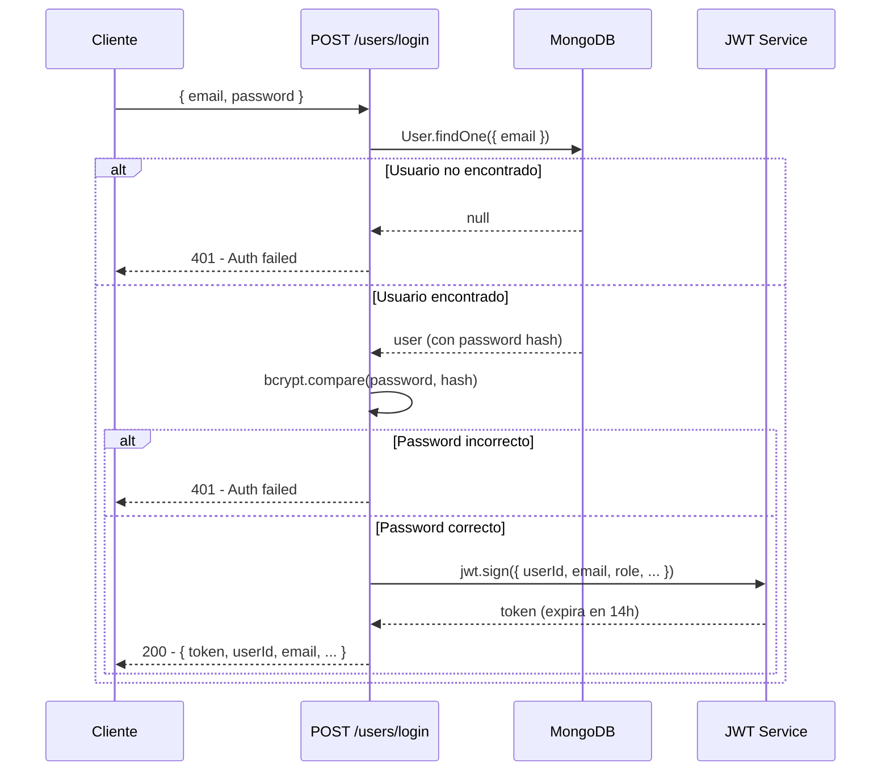

### 5.2 Login de Conductor con Verificación

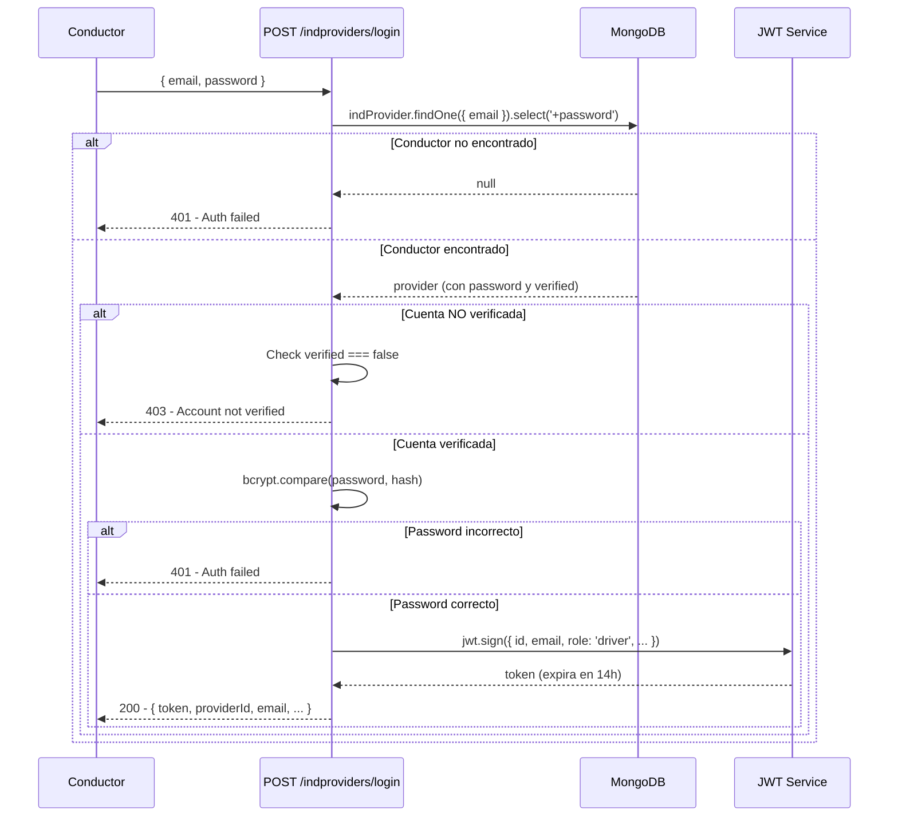

### 5.3 Creación de Booking

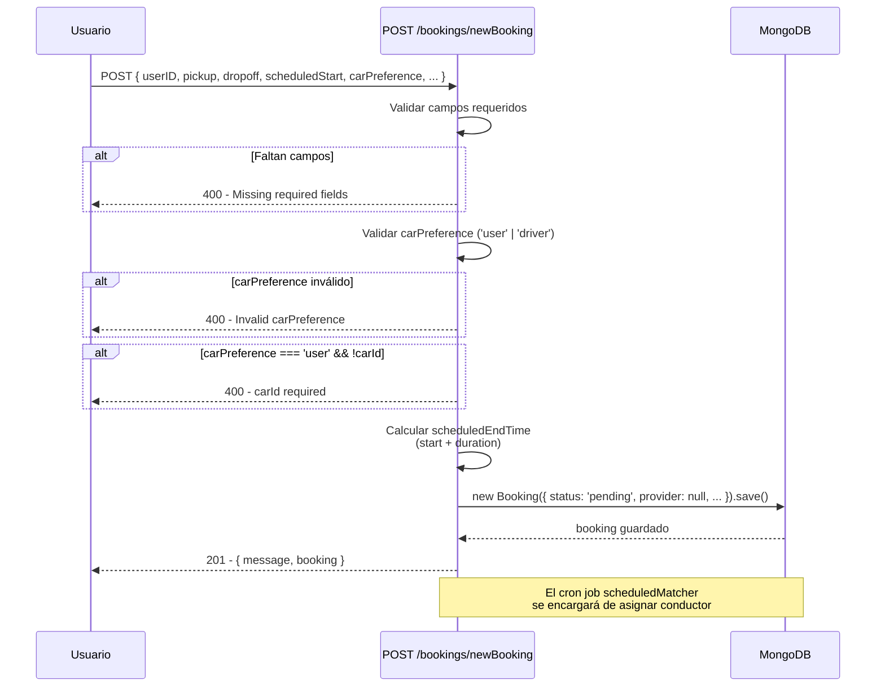

### 5.4 Sistema de Matching Automático (Cron Job)

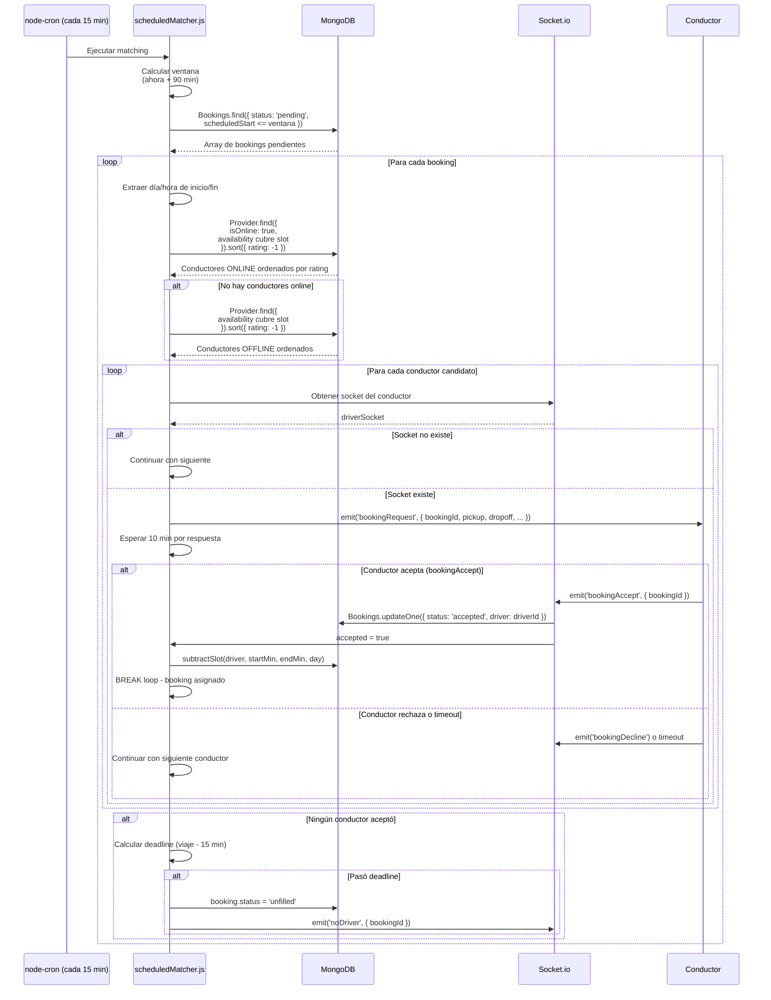

### 5.5 Conexión de Conductor via Socket.io

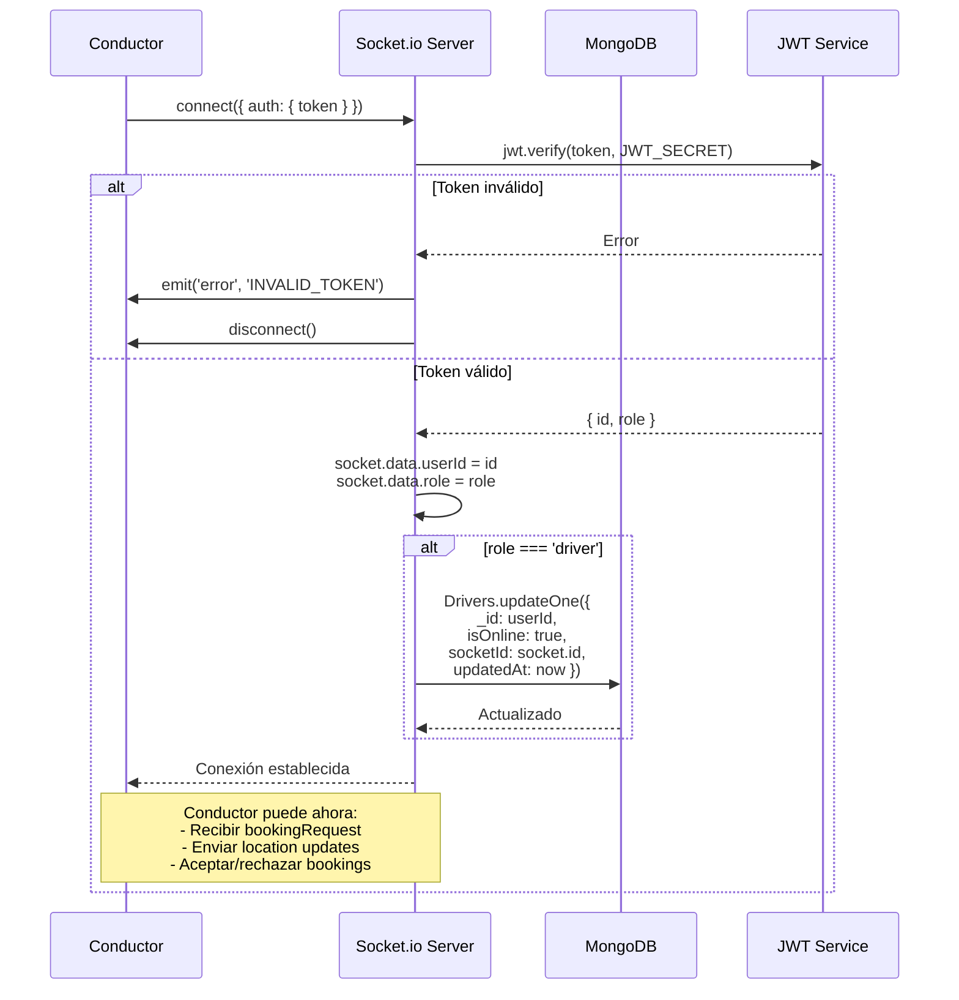

### 5.6 Flujo Completo de Viaje (Happy Path)

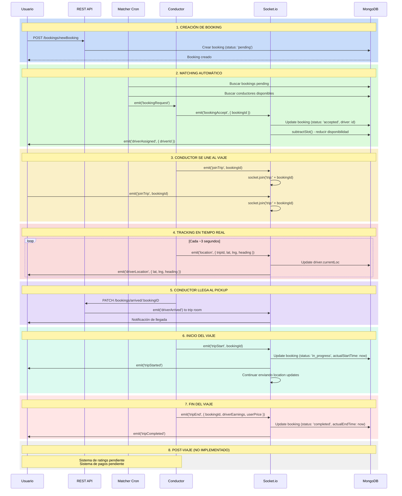

### 5.7 Streaming de Ubicación del Conductor

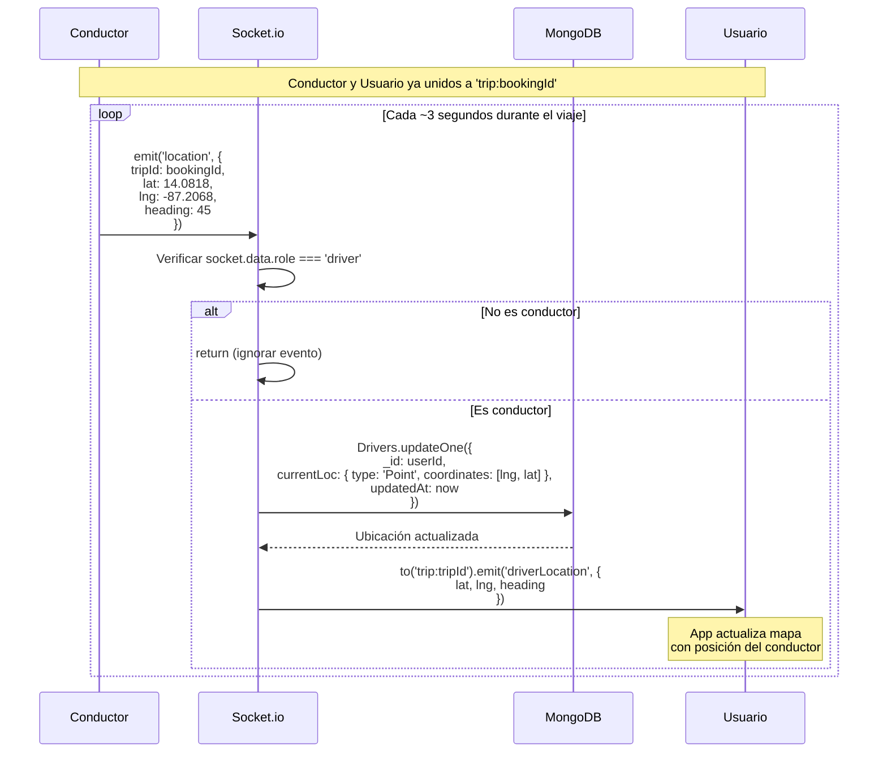

### 5.8 Aceptación de Booking por Conductor

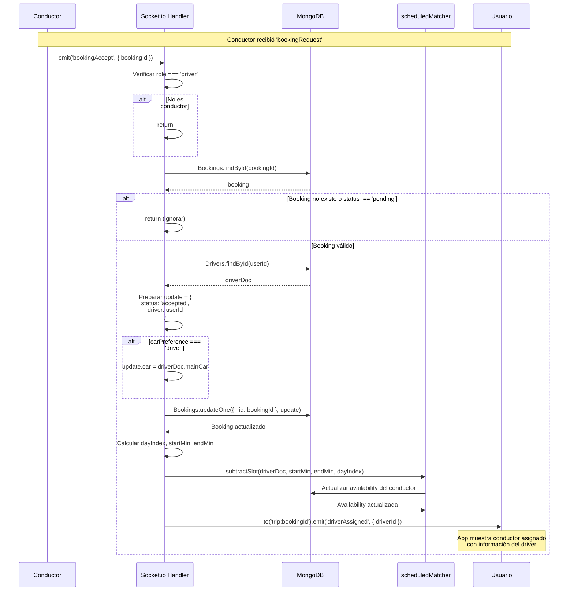

### 5.9 Actualización de Estado de Booking (REST)

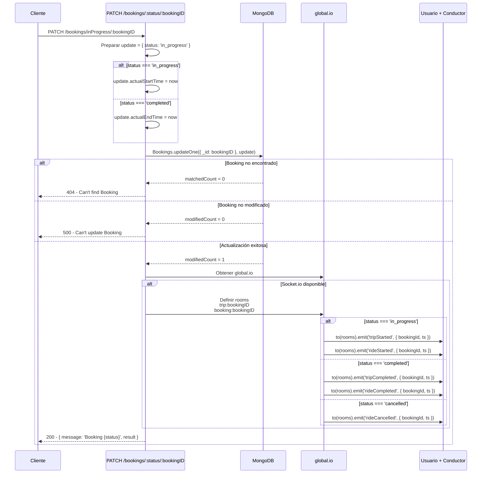

### 5.10 Consulta de Conductores Disponibles

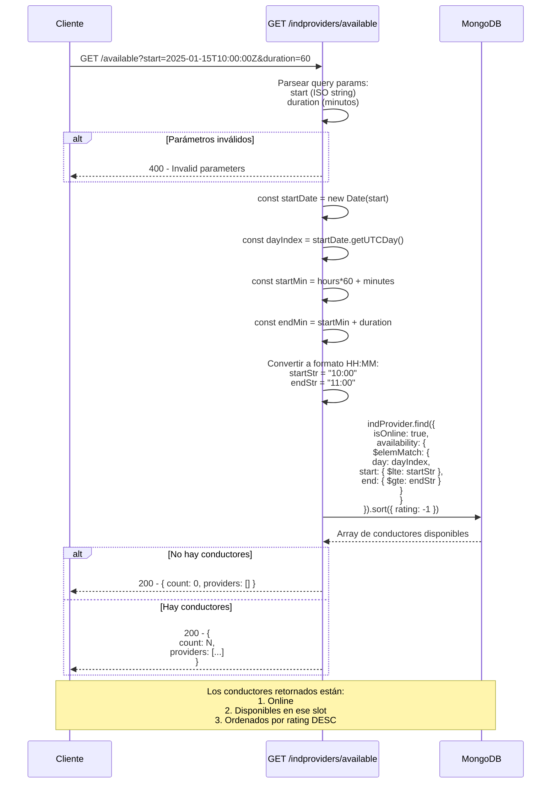

### 5.11 Obtención de Ruta con Mapbox

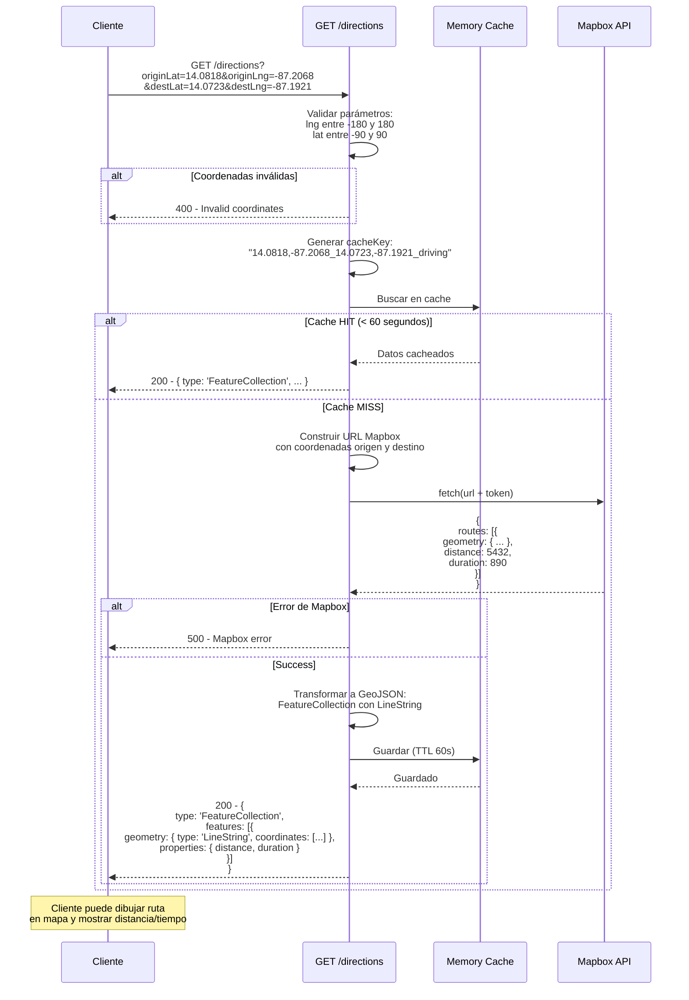

### 5.12 Flujo de Pago con PixelPay (Propuesto)

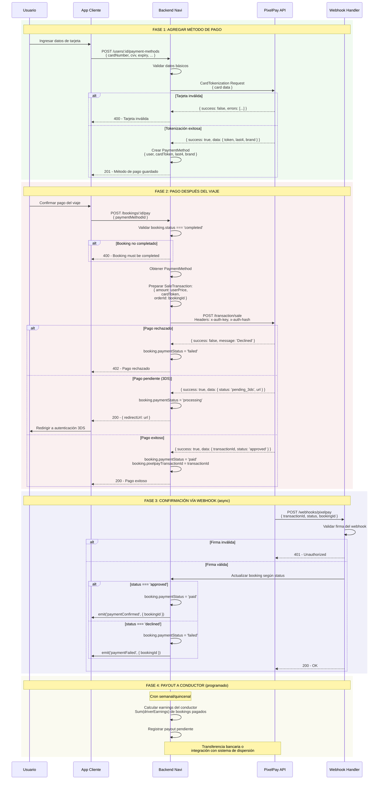

---

## NOTAS SOBRE LOS DIAGRAMAS

### Convenciones Utilizadas:
- **Bloques de color** en el diagrama 5.6 representan las diferentes fases del viaje
- **alt/else** representa decisiones condicionales
- **loop** representa iteraciones
- **rect** agrupa secuencias lógicas relacionadas

### Limitaciones Conocidas (reflejadas en los diagramas):
1. **Diagrama 5.4 (Matching)**: El campo `scheduledStart` debería ser `scheduledStartTime` (BUG 5)
2. **Diagrama 5.8 (Aceptación)**: La función `subtractSlot` debe ser exportada (BUG 1)
3. **Diagrama 5.1-5.2 (Login)**: Inconsistencia JWT_KEY vs JWT_SECRET (BUG 2)
4. **Diagrama 5.6 (Fase 8)**: Ratings y pagos NO están implementados

### Eventos Socket.io Implementados:
- `bookingRequest` - Servidor → Conductor (nuevo booking disponible)
- `bookingAccept` - Conductor → Servidor (acepta booking)
- `bookingDecline` - Conductor → Servidor (rechaza booking)
- `joinTrip` - Cliente → Servidor (unirse a room de viaje)
- `location` - Conductor → Servidor (actualización GPS)
- `driverLocation` - Servidor → Usuario (posición del conductor)
- `tripStart` - Conductor → Servidor (iniciar viaje)
- `tripStarted` - Servidor → Clientes (viaje iniciado)
- `tripEnd` - Conductor → Servidor (finalizar viaje)
- `tripCompleted` - Servidor → Clientes (viaje completado)
- `driverAssigned` - Servidor → Usuario (conductor asignado)
- `driverArrived` - Servidor → Usuario (conductor llegó)
- `noDriver` - Servidor → Usuario (no se encontró conductor)

### Eventos Socket.io Propuestos para Pagos (Diagrama 5.12):
- `paymentConfirmed` - Servidor → Usuario (pago confirmado por webhook de PixelPay)
- `paymentFailed` - Servidor → Usuario (pago rechazado/fallido)
- `paymentProcessing` - Servidor → Usuario (pago en proceso de autenticación 3DS)
